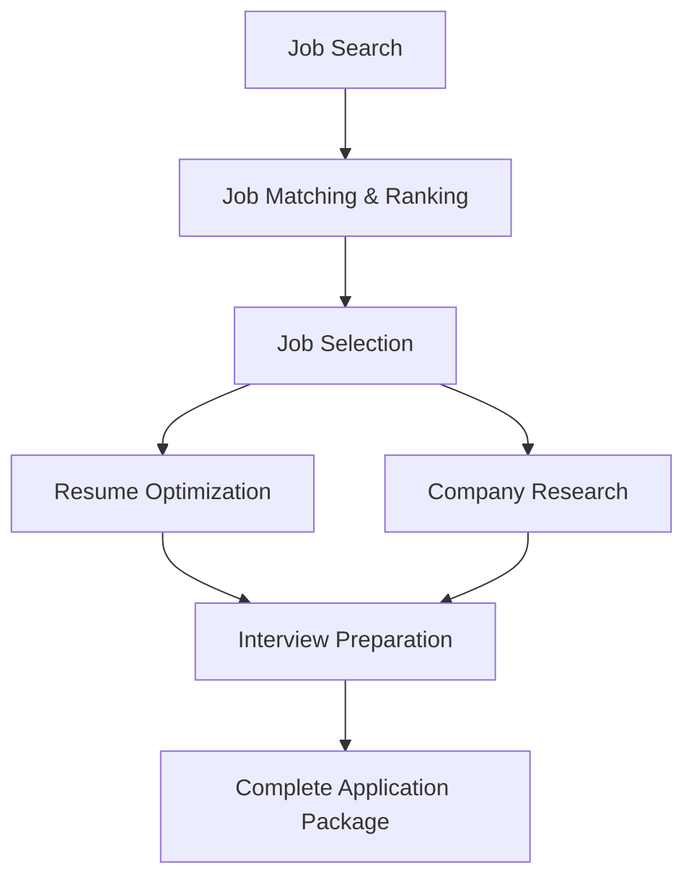

# Job Hunter Agent

An intelligent AI-powered job search and application preparation system built with CrewAI. This agent automates the entire job hunting workflow from finding relevant positions to preparing comprehensive interview materials.

## 🚀 Features

- **Automated Job Search**: Searches for relevant job opportunities using web scraping
- **Intelligent Job Matching**: Evaluates job fit based on your resume and preferences
- **Resume Optimization**: Tailors your resume to match specific job requirements
- **Company Research**: Conducts deep research on target companies
- **Interview Preparation**: Generates comprehensive interview prep materials

## 🏗️ Architecture

The system uses a multi-agent approach with specialized AI agents:

### Agents

1. **Job Search Agent** - Discovers and extracts job listings from major platforms
2. **Job Matching Agent** - Evaluates job-resume alignment and ranks opportunities
3. **Resume Optimization Agent** - Tailors resumes for specific job applications
4. **Company Research Agent** - Researches companies and provides strategic insights
5. **Interview Prep Agent** - Creates comprehensive interview preparation materials

### Workflow



## 📋 Prerequisites

- Python 3.13+
- OpenAI API key
- Firecrawl API key (for web scraping)

## 🛠️ Installation

1. **Clone the repository**

   ```bash
   git clone <repository-url>
   cd job-hunter-agent
   ```

2. **Install dependencies using uv**

   ```bash
   uv sync
   ```

3. **Set up environment variables**

   Create a `.env` file in the project root:

   ```env
   OPENAI_API_KEY=your_openai_api_key_here
   FIRECRAWL_API_KEY=your_firecrawl_api_key_here
   ```

## 📁 Project Structure

```text
job-hunter-agent/
├── config/
│   ├── agents.yaml          # Agent configurations and roles
│   └── tasks.yaml           # Task definitions and workflows
├── knowledge/
│   └── resume.txt           # Your resume (input file)
├── output/
│   ├── rewritten_resume.md  # Optimized resume for target job
│   ├── company_research.md  # Company analysis and insights
│   └── interview_prep.md    # Comprehensive interview preparation
├── main.py                  # Main application entry point
├── models.py                # Pydantic data models
├── tools.py                 # Custom tools (web search)
└── pyproject.toml          # Project dependencies
```

## 🚀 Usage

### Basic Usage

Run the job hunter with default parameters:

```bash
uv run python main.py
```

### Customizing Search Parameters

Edit the `main.py` file to customize your job search:

```python
result = (
    JobHunterCrew()
    .crew()
    .kickoff(
        inputs={
            "level": "Senior",           # Job level: Junior, Mid, Senior
            "position": "Backend Developer",  # Job title
            "location": "Remote",        # Location preference
        }
    )
)
```

### Preparing Your Resume

1. Place your resume in `knowledge/resume.txt`
2. Format it in Markdown for best results
3. Include all relevant skills, experience, and achievements

## 📊 Output Files

The system generates three key output files:

### 1. `output/rewritten_resume.md`

- Tailored resume optimized for the selected job
- Emphasizes relevant skills and experience
- Uses job-specific keywords and terminology

### 2. `output/company_research.md`

- Company overview and mission
- Recent news and developments
- Role context and team structure
- Predicted interview topics
- Strategic questions to ask

### 3. `output/interview_prep.md`

- Comprehensive interview preparation guide
- Job fit analysis
- Resume highlights for the role
- Predicted questions and answers
- Strategic advice and talking points

## 🔧 Configuration

### Agent Configuration (`config/agents.yaml`)

Each agent has specific roles, goals, and backstories:

- **Job Search Agent**: Senior Job Market Research Specialist
- **Job Matching Agent**: Job Matching Expert
- **Resume Optimization Agent**: Resume Optimization Specialist
- **Company Research Agent**: Company Research and Interview Strategist
- **Interview Prep Agent**: Interview Strategist and Preparation Coach

### Task Configuration (`config/tasks.yaml`)

Defines the workflow and expected outputs for each task:

- Job extraction and filtering
- Job matching and scoring
- Job selection and justification
- Resume rewriting and optimization
- Company research and analysis
- Interview preparation and strategy

## 🛠️ Customization

### Adding New Tools

Extend the system by adding new tools in `tools.py`:

```python
@tool
def custom_tool(query: str):
    """
    Custom tool description.
    """
    # Implementation here
    return result
```

### Modifying Agent Behavior

Update agent configurations in `config/agents.yaml` to change:

- Agent roles and expertise
- Goals and objectives
- Backstories and experience
- LLM models and parameters

### Customizing Data Models

Extend the Pydantic models in `models.py` to add new fields or modify existing structures.

## 📈 Example Output

The system successfully processed a job search for a "Junior Backend Developer" position in Korea, resulting in:

- **Job Discovery**: Found multiple relevant positions
- **Job Matching**: Ranked jobs based on fit (1-5 scale)
- **Job Selection**: Chose Stream (GetStream.io) as the best match
- **Resume Optimization**: Tailored resume for Go/backend focus
- **Company Research**: Comprehensive analysis of Stream's business
- **Interview Prep**: Detailed preparation guide with 10+ predicted questions

## 🔍 Key Technologies

- **CrewAI**: Multi-agent orchestration framework
- **OpenAI GPT-4**: Large language model for agent reasoning
- **Firecrawl**: Web scraping and content extraction
- **Pydantic**: Data validation and serialization
- **Python 3.13**: Modern Python with latest features

## 🤝 Contributing

1. Fork the repository
2. Create a feature branch
3. Make your changes
4. Add tests if applicable
5. Submit a pull request

## 📄 License

License information not specified. Please check with the project maintainers for licensing details.

## 🆘 Troubleshooting

### Common Issues

1. **API Key Errors**: Ensure your OpenAI and Firecrawl API keys are correctly set in the `.env` file
2. **Import Errors**: Run `uv sync` to install all dependencies
3. **File Not Found**: Ensure `knowledge/resume.txt` exists and is properly formatted
4. **Output Directory**: The system will create the `output/` directory automatically

### Getting Help

- Check the logs for detailed error messages
- Ensure all dependencies are installed correctly
- Verify API keys have sufficient credits
- Review the configuration files for any syntax errors
